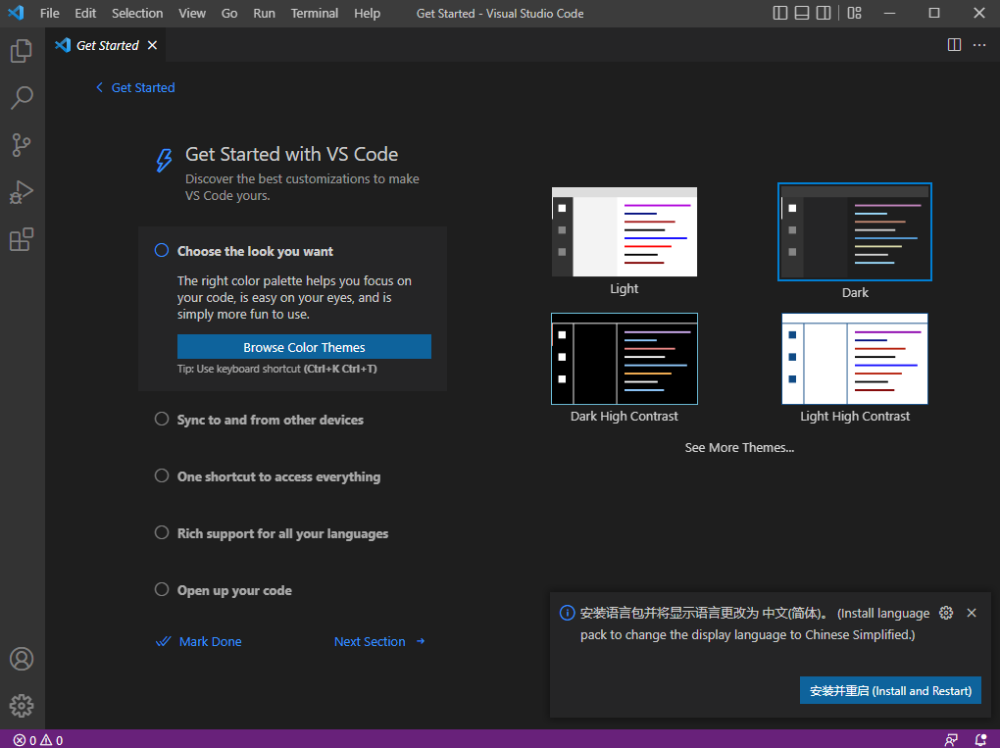

# 《前端技术文档》

本文档面向业务，旨在帮助前端开发人员快速搭建开发环境、了解编码规范，开发人员需严格遵守规范中的工具配置、编码方式。

### 工具链接

| 工具名称          | 页面地址                       |
| ----------------- | ------------------------------ |
| jenkins           | https://www.jenkins.io/        |
| 禅道              | https://www.zentao.net/        |
| YApi 接口管理工具 | https://yapi.pro/              |
| trello            | https://trello.com/            |
| vsCode            | https://code.visualstudio.com/ |

## 环境配置

| 环境                                                       | 版本      |
| ---------------------------------------------------------- | --------- |
| windows                                                    | 10 或以上 |
| [nodeJS](https://nodejs.org/zh-cn/)                        | 团队协定   |
| npm                                                        | 团队协定   |
| [python](https://www.python.org/downloads/windows/)        | 2.7.18    |
| [nvm](https://github.com/coreybutler/nvm-windows/releases) | 最新版本  |
| [git](https://git-scm.com/)                                | 最新版本  |
| [VSCode](https://code.visualstudio.com/)                   | 最新版本  |

## 开发环境搭建

### 第一步：安装 git


因为我们需要一个能在 windows 中运行的 _linux 环境_ 来执行命令，所以我们先 [安装 git](https://git-scm.com/)，并使用 _Git Bash_ 来执行接下来的操作。

_注：安装 git 过程中，自定义安装路径后，一路 Next 即可_

### 第二步：安装 nvm


使用 nvm 来管理本机的 _node 版本_，在 nvm 官网中下载 [nvm-setup.exe](https://github.com/coreybutler/nvm-windows/releases)，并右键 _以管理员身份运行_ 安装。

_注：nvm 安装时需以管理员身份运行安装包，安装目录和 node 管理目录最好设置为 C 盘 的一级目录，避免 node 版本管理权限问题。_

### 第三步：安装 node

右键 Git Bash，选中 “以管理员身份运行” 打开


执行命令 `nvm install 14.18.3`，


等待命令执行完毕后，输入 `nvm use 14.18.3` 来使用该版本的 node。


_注：使用 node -v 和 npm -v 查看 node 和 npm 的版本是否正确_

### 第四步：安装 python

下载 [python2.7 版本](https://www.python.org/downloads/windows/) 的 windows 安装包，并安装。

_注：安装过程中需要勾选 `Add python.exe to path`，选择 `entire feature will be installed on local hard drive`，这样 python 就会自动添加到环境变量中。_

安装完成后，在 cmd 中键入 `python`，出现以下字样，则证明 python 环境配置成功。


### 第五步：安装 VSCode


[下载 VSCode](https://code.visualstudio.com/) 并安装，安装过程中将 _其它_ 全部勾选，尤其是以下两项：

- [x] 将“通过 Code 打开”操作添加到 Windows 资源管理器文件上下文菜单
- [x] 将“通过 Code 打开”操作添加到 Windows 资源管理器目录上下文菜单

安装完成后，打开 VSCode，并根据提示安装中文语言包



_下面是安装中文语言包后的界面_


### 第六步：安装 VSCode 常用插件

| 名称                      | 作用                                                                                            |
| ------------------------- | ----------------------------------------------------------------------------------------------- |
| Vetur                     | vue 语法高亮                                                                                    |
| Vue VSCode Snippets       | vue 代码提示。需以字符 v 开头，搭配 vue 的 api，如：vbase、vdata、vmethod，出现提示后回车即可。 |
| Prettier                  | vue、js、json 的默认格式化工具。格式化文件快捷键为 `Shift + Alt + F`。                          |
| Git History               | git 版本管理工具                                                                                |
| Auto Rename Tag           | 自动修改匹配的 HTML 标签                                                                        |
| Tailwind CSS IntelliSense | Tailwind.css 自动补全                                                                           |

### 第七步：配置 VSCode

键入 `Ctrl + Shift + p`，然后搜索 “Open Settings(JSON)”，将以下配置粘贴到 **_settings.json_** 中，最后 _Ctrl + s_ 保存即可。

```
{
  // 设置prettier为默认格式化工具
  "[]": {
    "editor.defaultFormatter": "esbenp.prettier-vscode"
  },
  "[typescript]": {
    "editor.defaultFormatter": "esbenp.prettier-vscode"
  },
  "[react]": {
    "editor.defaultFormatter": "esbenp.prettier-vscode"
  },
  "[typescriptreact]": {
    "editor.defaultFormatter": "esbenp.prettier-vscode"
  },
  "[json]": {
    "editor.defaultFormatter": "esbenp.prettier-vscode"
  },
  "[jsonc]": {
    "editor.defaultFormatter": "esbenp.prettier-vscode"
  },
  "[scss]": {
    "editor.defaultFormatter": "esbenp.prettier-vscode"
  },
  "[vue]": {
    "editor.defaultFormatter": "esbenp.prettier-vscode"
  },
  // 默认制表符为两个空格
  "editor.tabSize": 2,
  // 行高
  "editor.lineHeight": 30,
  // 字号
  "editor.fontSize": 14,
  // 代码字符长度，超出换行
  "prettier.printWidth": 120,
  "prettier.htmlWhitespaceSensitivity": "ignore",
  // 取消git同步前确认
  "git.confirmSync": false,
  // 键入Tab后自动补齐标签
  "emmet.triggerExpansionOnTab": true,
  // 关闭<script>和<style>的缩进
  "prettier.vueIndentScriptAndStyle": false,
  // 取消当箭头函数仅有一个参数时加上括号
  "prettier.arrowParens": "avoid",
  // 取消阻止代码段的快速建议，适配tailwindCSS的快速建议
  "editor.suggest.snippetsPreventQuickSuggestions": false,
}
```


_注：VSCode 默认的 Ctrl+S 为保存单个文件，我们需要在 “文件 -> 首选项 -> 键盘快捷方式” 中，搜索 “保存所有文件” ，并将其键绑定为 “Ctrl+S”_


### 第八步：安装浏览器

所有前端项目，都支持 _ie9+_，支持 _flex 特性_，因为我们的客户大多用国产化内核的浏览器，我们一般选用 **_火狐浏览器_** 作为前端的 **默认浏览器** 使用。

考虑到大部分前端开发同事都默认使用 _Chrome（谷歌浏览器）_，并装了很多开发相关的插件，所以关于浏览器这块不作强制规定，大家自行选择。

但要求前端样式、功能必须在 _火狐_ 和 _谷歌_ 浏览器中保持一致！

[下载火狐浏览器](http://www.firefox.com.cn/)

[下载谷歌浏览器](https://www.google.com/intl/zh-CN/chrome/)

## 编码目标

### 轻量

单 vue 文件中，代码行数应在 300 行以下，最高不得高于 500 行。

### 规范

遵循少量的规范，便可轻松的开发。

### 易维护

命名清晰、完整，注释言简意赅，数据、方法分块展示。

### 易拆解

业务、组件互相解耦，单独修改互不影响。

_注：所有 vue 代码中 template、script、style 三者加起来，代码行数不得超过 500 行，项目组需定期检查代码，超过 500 行的单 vue 文件，视为 **庞大且不可维护的**，必须拆分和重构。（自定义程度较高的业务除外）_

## 目录规范

```
src
 |—api              接口目录
 |—assets           静态文件
 |—components       公共组件
 |—layout           布局
 |—router           路由
 |—store            vuex
 |—styles           样式
 |—utils            公共函数
 |—views            页面
```

### api 目录命名规则

默认每个业务单独对应自己的 _api.js_ 文件，公用 API（如：下载、导出等）都放到 _common.js_。示例如下：

```
src
 |—api
    |-common.js
    |-personalManage.js
 |-views
    |-personalManage.vue
```

## 编码规范

### .vue 文件书写规范


### api

api 文件夹中，存放所有的业务接口，规定每个业务要有自己对应的 api.js 文件，目录示例如下：

```
api
|-bank.js
|-login.js
|-meeting.js
```

公用 api 放到 _common.js_ 中，使用 axios 封装的 **_rhRequest.js_** 进行请求，每个 api 注明用途，格式如下：

```
// bank.js
import rhRequest from "@/utils/rhRequest";

// 银行列表
export function getBankList(params) {
    return rhRequest({
        url: "/bank/list",
        method: "post",
        data: params
    });
}
```

对于后端请求，我们常见的传参方式有 GET、POST、DELETE 等，有时候需要将参数 **_序列化_** 后再传给后端，有时候需要在 POST 传参中，在 _URL 后携带参数_，有时候需要 _下载文件_，增加 _responseType_，示例如下：

```
// bank.js
import rhRequest from "@/utils/rhRequest";
import qs from "qs";

// post传参，参数在body
export function getBankList(params) {
    return rhRequest({
        url: "/bank/list",
        method: "post",
        data: params
    });
}

// post传参，参数在body，需要序列化参数
export function getBankDetail(params) {
    return rhRequest({
        url: "/bank/detail",
        method: "post",
        data: qs.stringify(params)
    });
}

// post传参，参数在url
export function getBankBck(params) {
    return rhRequest({
        url: "/bank/bck",
        method: "post",
        params
    });
}

// get传参，参数在url
export function getBankPersons(params) {
    return rhRequest({
        url: "/bank/persons",
        method: "get",
        params
    });
}

// post传参，下载文件，更改 responseType 为 blob
export function exportBankExcel(params) {
    return rhRequest({
        url: '/export/bank/excel',
        method: 'post',
        data: params,
        responseType : "blob",
    })
}

// get传参，下载文件，更改 responseType 为 blob
export function exportBankExcel(params) {
    return rhRequest({
        url: '/export/bank/excel',
        method: 'get',
        params,
        responseType : "blob",
    })
}
```

_注：一般情况下，post 传参都是放在 body 里，但是在某些接口中，后端会出现接收不到传参的情况，这时候就可以尝试使用 [qs](https://github.com/ljharb/qs) 的 qs.stringify 方法将参数序列化后，再放到 body 里传给后端。（或者改用 post 方式的 url 传参，虽然很奇怪，但是有些情况，后端确实需要这种传参方式。）_

### assets

assets 文件中存放图片、iconfont、svg 等静态资源。

_注：正式环境上线前，需要将图片体积压缩，以保证打包后静态文件的体积是最小的，提升前端页面的加载速度。_

### components

**1、命名**

components 文件夹中，命名遵循 _所有单词首字母大写_，示例如下：

```
components
|-RhComponent.vue
```

所有公共组件必须以 **Rh** 为前缀开头，示例如下：

```
components
|-RhTable.vue
|-RhWrapper.vue
|-RhDatePicker.vue
```

**2、样式**

组件的样式命名中，遵循 **[BEM](http://getbem.com/)** 方法，统一添加前缀 **_rh-_**，并使用 **_scoped_** 隔离自身样式，示例如下：

```
<template>
  <div class="rh-wrapper">
    <div class="rh-wrapper-title"></div>
    <div class="rh-wrapper-main">
      <slot></slot>
    </div>
  </div>
</template>

<style lang="scss" scoped>
.rh-wrapper {
  background-color: #fff;

  &-title {
    font-weight: bold;
  }

  &-main {
    padding: 20px;
  }
}
</style>
```

_注：components 文件夹中，只允许出现公共组件，组件内强调与业务解耦，可在不同页面、组件中拆解使用。不可出现过于庞大且不可维护的组件。硬性规定每个文件中代码行数不得超过 500 行，超过 500 行则视为 **庞大且不可维护的** 组件，必须拆分和重构。_

**3、引入方式和闭合标签**

引入组件时，命名应与组件名称完全一致，且没有内容的组件应该是自闭合的（应取消无意义的闭合标签，保持代码简洁），示例如下：

```
<template>
  <!-- xxx业务 -->
  <RhWrapper>
    <RhTable />

    <!-- 这里没必要使用 kebab-case格式 ，虽然它也可以使用 -->
    <!-- <rh-table></rh-table> -->
  </RhWrapper>
</template>

<script>
import RhWrapper from "@/components/RhWrapper"
import RhTable from "@/components/RhTable"

export default {
  components: {
    RhWrapper,
    RhTable
  }
}
</script>
```

_注：为了能够快速定位组件的引入问题，我们在 vue 单文件中使用组件时，都保持引入名称的 PascalCase 格式 不变，没必要使用 kebab-case 格式 做区分。_

### styles

styles 文件夹负责存放所有的样式文件，包括 _第三方 UI 库的样式覆盖文件、reset.css、variables.scss、mixin.scss_ 等，示例如下：

```
styles
|-element-variables.scss
|-normalize.css
|-tailwind.css
|-...
```

### utils

utils 文件夹负责存放所有的函数文件，含 _公共函数、请求函数、特定业务函数_ 等，默认有 _common.js、rhRequest.js_，示例如下：

```
utils
|-common.js           公共函数库
|-rhRequest.js        axios封装的请求函数
|-...
```

函数的命名要 _符合函数自身的作用_，并写好中文注释。函数的写法、导入方式示例如下：

```
<!-- 函数写法 common.js -->
// 数组转树形结构
export function arr2tree(data) {
  // do something
}

<!-- 函数用法 bank.vue -->
<script>
import { arr2tree } from "@/utils/common";
</script>
```

### layout

layout 文件夹视为独立的 components，它的出现，只是为了单独维护最外层的包裹样式和逻辑功能，所以它与 components 文件夹规范保持一致。

_注：不允许任何业务页面、组件引入 layout 中的任何一个文件。_ **_layout 文件夹保持绝对的独立。_**

### views

**1、命名**

views 文件夹中，业务页面命名遵循 _小驼峰法_，首字母小写，其余单词首字母大写，命名方式为 **_业务 + 功能_**，示例如下：

```
views
|— sysConfig.vue
|— allFileManage.vue
|— home.vue
```

_注：不允许出现拼音、数字、携带尾缀等命名，所有文件、文件夹命名必须为英文或其缩写，意思必须贴近其所代表业务。_

```
<!-- 这些命名都是不允许出现的 -->
views
|— xitongpeizhi.vue
|— allFileManage1.vue
|— home copy.vue
```

**2、业务内组件**

如遇需在业务代码中增加 _components_ 文件夹的，默认视为增加业务代码，其具有特定的业务特征，所以在 _views_ 文件夹中，_components_ 内命名仍遵守 _小驼峰法_， 首字母小写，其余单词首字母大写，示例如下：

```
views
|— system
   |— components
      |— addSysDialog.vue
         |— sysList.vue
      |— index.vue
```

业务组件的命名方式通常是 **_功能 + 类型_**，示例如下：

```
components
|- updateFormDialog.vue
|- searchListTable.vue
```

**3、样式**

业务页面中的样式命名，建议仍然遵循 **[BEM](http://getbem.com/)** 规范，但是必须添加 scoped ，用以隔离样式，杜绝样式污染，示例如下：

```
<template>
  <!-- xxx业务 -->
  <div class="demo"></div>
</template>

<style lang="scss" scoped>
.demo {
  font-size: 14px;
}
</style>
```

样式预处理器编译器我们使用 _dart-sass_，对第三方组件库（如 _ElementUI_）的穿透方式为 **_::v-deep_**，示例如下：

```
<style lang="scss" scoped>
.demo {
  ::v-deep .el-input {
    background-color: red;
  }
}
</style>
```

或者

```
<style lang="scss" scoped>
.demo {
  ::v-deep(.el-input) {
    background-color: red;
  }
}
</style>
```

或者

```
<style lang="scss" scoped>
.demo {
  :deep(.el-input) {
    background-color: red;
  }
}
</style>
```

需要注意的是，为了防止业务样式污染全局，在我们业务代码修改第三方库样式时，必须用业务代码本身的 class 类包裹起来，这个是必须的。以上样式最终会被编译成这样：

```
/* scoped 样式中上述代码将会编译成 */
.demo[data-v-f3f3eg9] .el-input {
  background-color: red;
}
```

**4、点击事件、函数命名**

点击事件命名为 **_handle + 功能_**。

函数命名分为两类：如果有实际意义，则以实际意义命名，如：获取 table 数据，则命名为 **_getTableList_**；如仅是单独提取的接口动作，则命名为 **_fn\_ + 接口名_** ，示例如下：

```
<template>
  <!-- xxx业务 -->
  <div @click="handleSearch">
    <RhTable @pageChange="handlePageChange" />
  </div>
</template>

<script>
import { getBankList, monyGetROI } from "@/api/bank";

export default {
  methods: {
    //查询
    handleSearch() {
      //做一些搜索前的重置操作
      this.getTableList();
    },
    //获取列表
    getTableList() {
      const params = {};
      getBankList(params)
        .then(res => {})
        .catch(err => {})
    },
    //获取回报率
    fn_monyGetROI() {
      const params = {};
      monyGetROI(params)
        .then(res => {})
        .catch(err => {})
    }
  }
}
</script>
```

**5、标签的属性、绑定值、方法**

默认排序为 **_html 原生属性 > 组件属性 > 绑定值 > 方法_**（可以简单理解为 _不带冒号 > 带冒号 > 带@符号_），如果组件内属性与 html 原生属性相同，则按 html 原生属性处理，示例如下：

```
<template>
  <div class="demo">
    <el-input
      style="font-size: 18px"
      class="my-input"
      type="string"
      placeholder="请输入"
      clearable
      show-password
      v-model="value"
      @change="handleInputChange"
    ></el-input>
  </div>
</template>

<script>
export default {
  data() {
    return {
      value: ""
    }
  },
  methods: {
    handleInputChange() {}
  }
}
</script>

<style>
.demo {
  ::v-deep .my-input {
    background-color: red;
  }
}
</style>
```

---

## git 提交规范

所有业务开发都在 master 以外的分支，_master 分支受保护，不允许提交代码_，只有在项目需要发版时，才通过 GitLab 提交合并请求合并至 master。

git 提交规范如下：

```
[+]:表示新增功能；
[^]:表示优化；
[#]:表示修复bug,建议提供bug编号；
[-]:表示移除功能；
```

示例：

```
[+]新增xxx页面页面
[-]删除xxx接口
[#]23751 修复xxxbug
[-]删除xxx
```

_注：提交说明中注明本次修改的内容，不要写 aaa 等无意义注释_

---

## 技术选型

全部采用 vue2.x 进行开发。

_注：考虑到技术、社区的成熟度，未来会升级至 vue3.x 版本进行开发，但均不会涉及 vue2.x 升级 vue3.x 的大规模项目重构，版本完全独立开发。_

| 名称       | 版本   |
| ---------- | ------ |
| Vue        | 2.6.14 |
| Vue-Router | 3.5.1  |
| Vuex       | 3.6.2  |
| element-ui | 2.15.9 |

### 插件版本

| 名称         | 版本     |
| ------------ | -------- |
| axios        | 最新版本 |
| qs           | 最新版本 |
| dayjs        | 最新版本 |
| lodash       | 最新版本 |
| Tailwind.css | 最新版本 |